# Project_Covid_Management

<p align="left">


</p>

Đồ án cuối kỳ môn Phát triển ứng dụng web - 19_3 (HCMUS).

### Thông tin nhóm:

|       Họ và tên      |   MSSV   | Email                           | 
|----------------------|:--------:|---------------------------------|
| Thới Hải Đức    | 19120483 | 19120483@student.hcmus.edu.vn            |
| Đỗ Thái Duy | 19120492 | 19120492@student.hcmus.edu.vn |
| Hồ Đắc Duy         | 19120493 | 19120493@student.hcmus.edu.vn        |
| Dương Nam         | 19120593 | 19120593@student.hcmus.edu.vn        |

### Các link liên quan:
- Hệ thống quản lý Covid Deploy: https://covidpc.herokuapp.com/
- Hệ thống Thanh toán Deploy: https://payment-web.herokuapp.com/
- Phân chia công việc: https://docs.google.com/document/d/1hUetQTFqDSreTyqV2qZPLSSSwLgYmWeV9VqZonSqUrg/edit?usp=sharing

### Các chức năng đã làm được:
- Các chức năng được đánh giá theo thang điểm trong file docx của link: https://docs.google.com/document/d/1mq-61Ss8JLvhhMzB8VybYv55A0bOlMzi/edit?usp=sharing&ouid=106547223030428986010&rtpof=true&sd=true
- Một vài hình ảnh demo:
> Giao diện đăng nhập
<div>
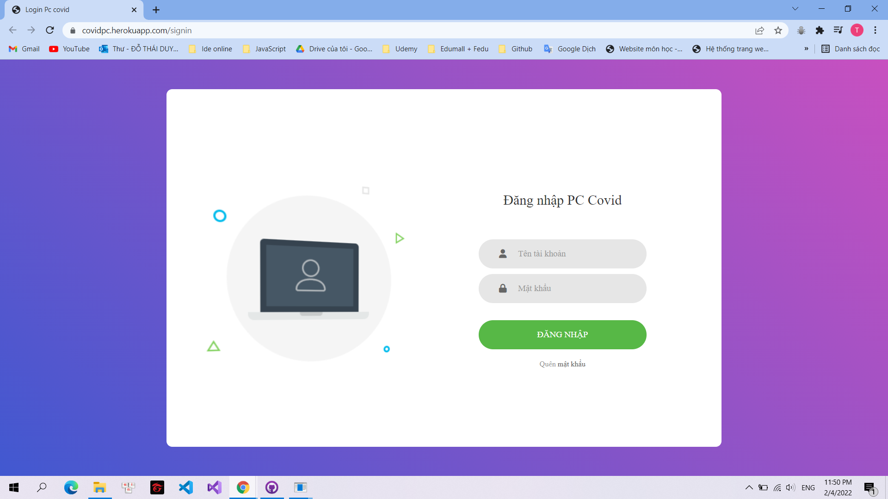
</div>

> Giao diện và chức năng của Quản trị viên (Admin):
<div>
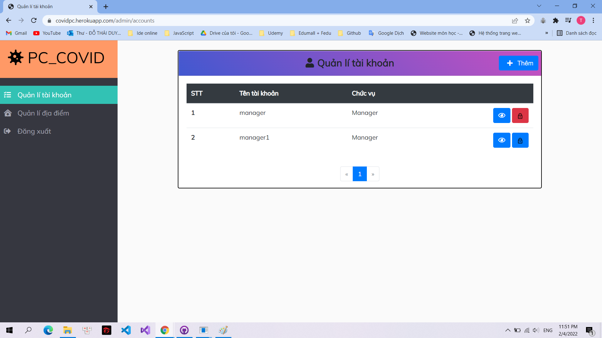
</div>
<div>
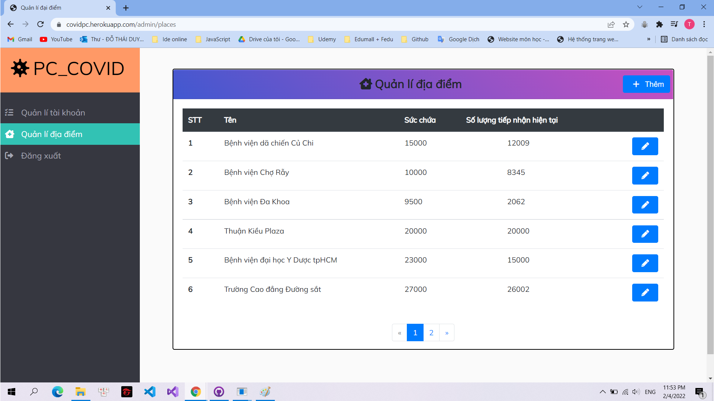
</div>

> Giao diện và chức năng của Người quản lý (Manager):
<div>
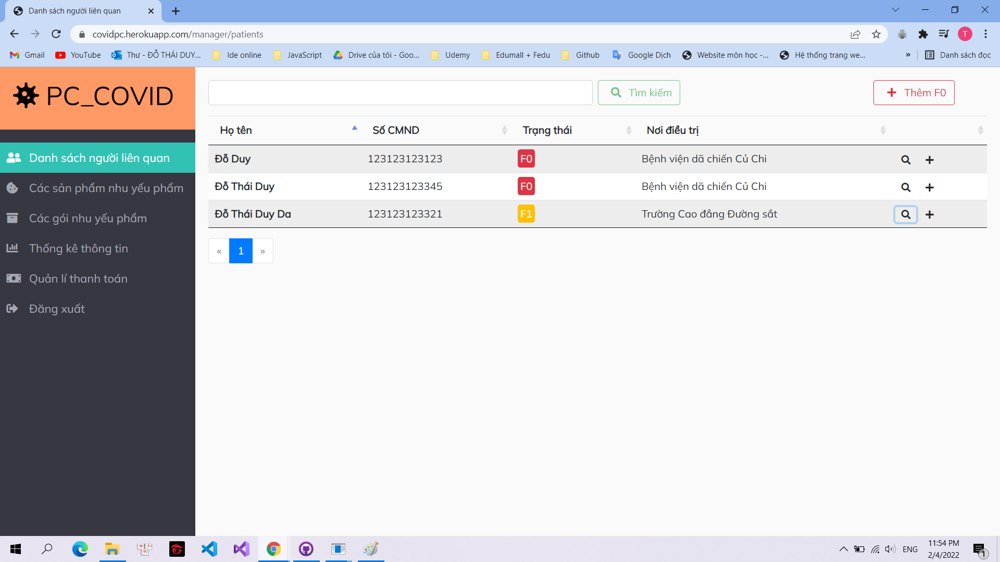
</div>
<div>
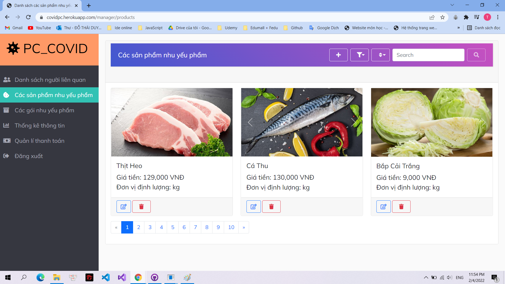
</div>
<div>
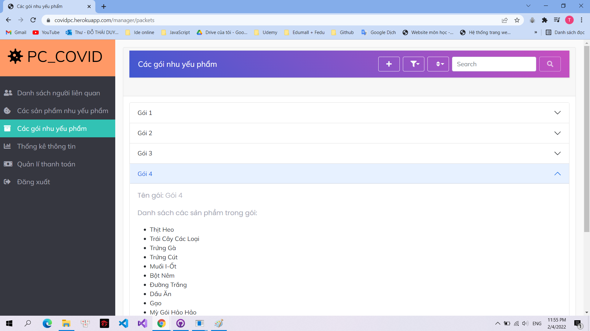
</div>
<div>
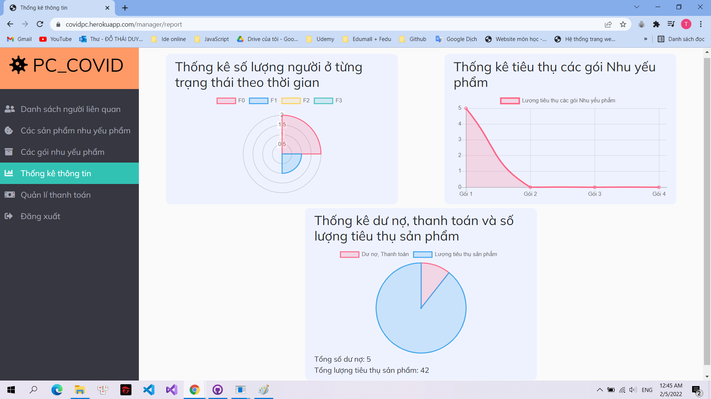
</div>
<div>
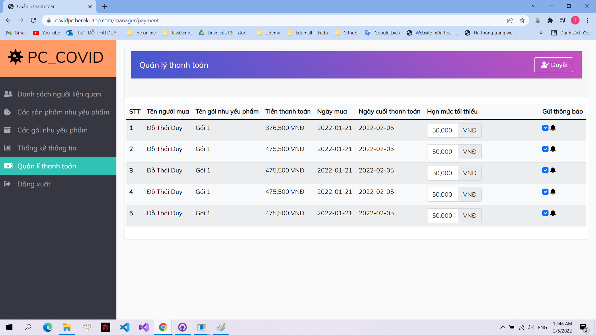
</div>

> Giao diện và chức năng của Người được quản lý (User):
<div>
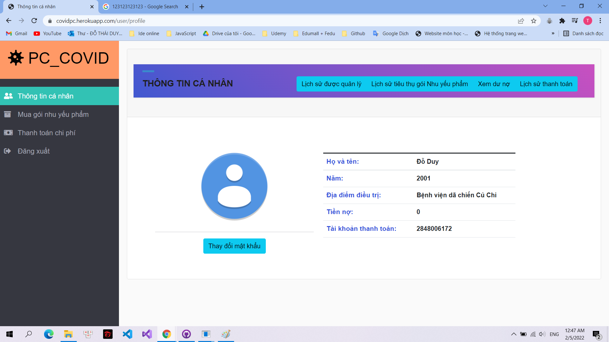
</div>
<div>
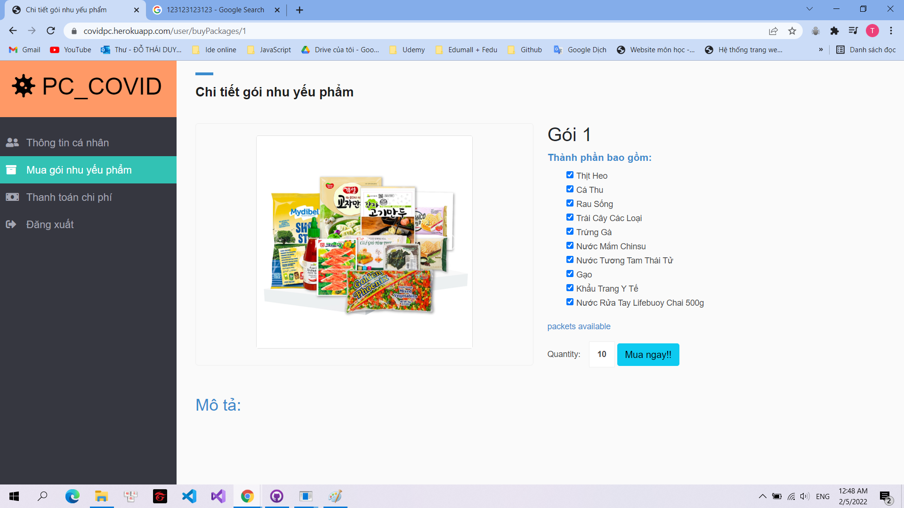
</div>
<div>
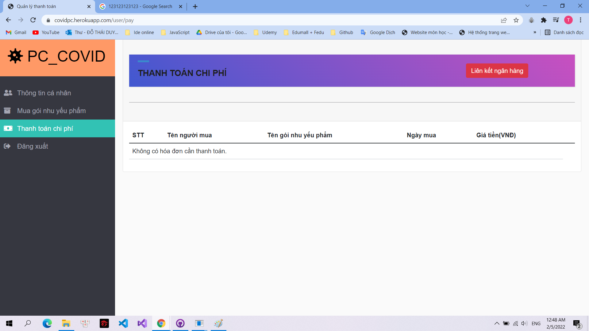
</div>

> Giao diện và chức năng của Hệ thống Thanh toán:
<div>
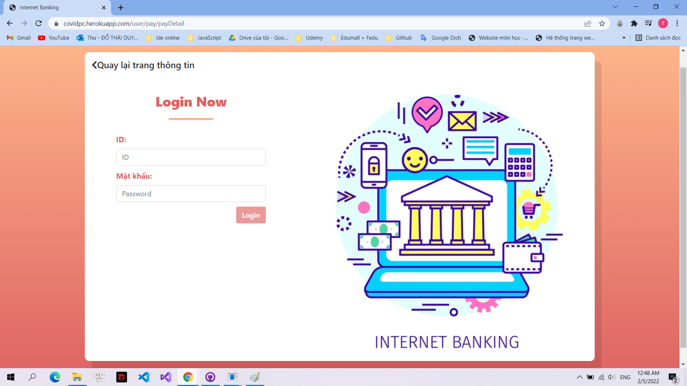
</div>
<div>

</div>
<div>
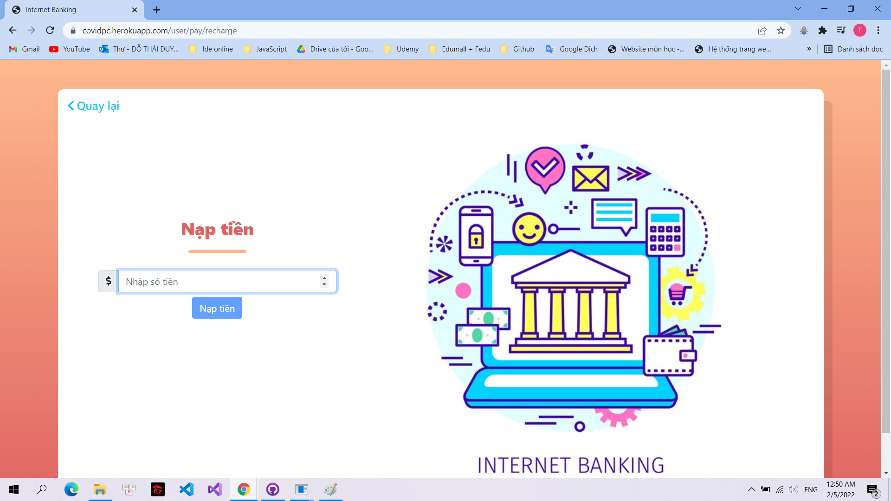
</div>

**- Đối với tài khoản của người quản lý để nhận tiền**
<div>
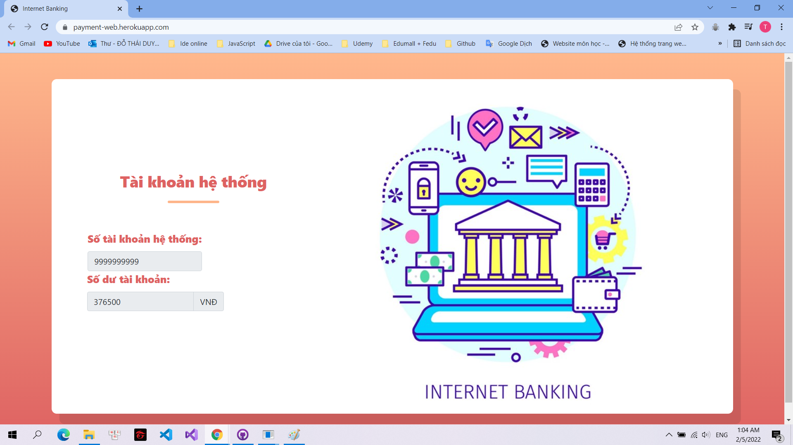
</div>

**- Khi có chi phí cần trả**
<div>

</div>
<div>
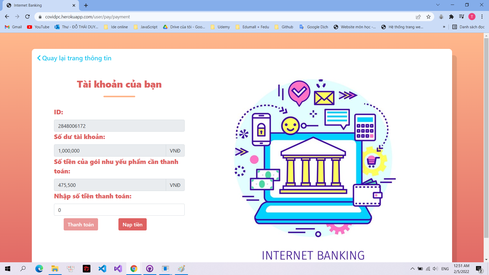
</div>

### Yêu cầu chương trình:
1. Cài đặt nodejs.
2. Cài đặt và tạo 2 cơ sở dữ liệu về Covid, Thanh toán sử dụng Postgres Sql.
### Cách chạy chương trình:
```bash
  Kết nối 2 hệ thống với 2 cơ sở dữ liệu đã được tạo

  npm install

  npm run dev
```
